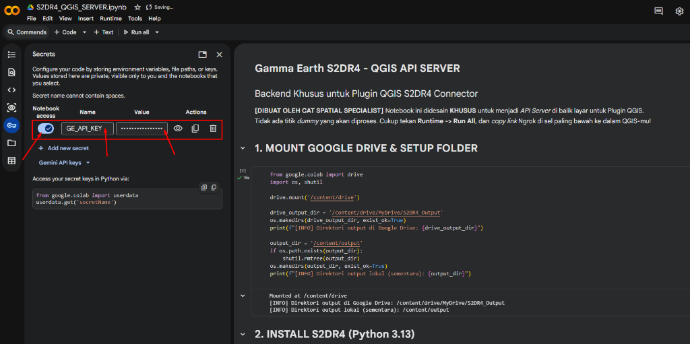
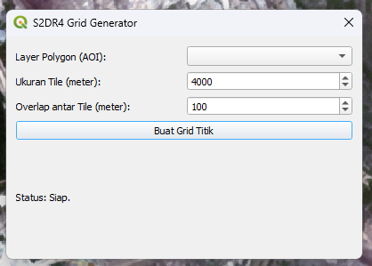
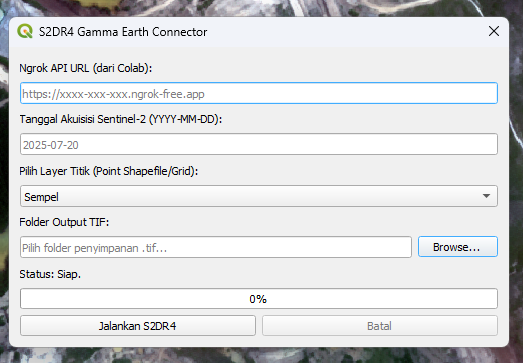

# S2DR4 Gamma Earth Connector untuk QGIS

S2DR4 Connector adalah *plugin* QGIS dan *Python Toolbox* ArcGIS yang menghubungkan *software* pemetaan desktop-mu dengan kekuatan Super-Komputer Google Colab. Alat ini memungkinkan pengguna untuk mendownload citra satelit **Sentinel-2** yang telah dipertajam menjadi resolusi **10 meter** menggunakan algoritma *Deep Learning* S2DR4 (Super-Resolusi) secara langsung ke dalam kanvas petamu.

Arsitektur sistem ini didesain menggunakan **Cloudflare Tunnel** dan **FastAPI** agar proses AI yang berat dapat berjalan di *cloud* secara gratis (melalui GPU Google Colab), sementara hasilnya langsung mengalir ke *harddisk* komputermu tanpa membebani penyimpanan Google Drive.

---

## 📋 Prasyarat Sistem
Sebelum memulai, pastikan kamu memiliki dua hal ini:
1. **Google Colab (Gratis):** Membutuhkan Akun Google biasa.
2. **QGIS Desktop / ArcGIS:** (Tidak perlu mendaftar tunnel, koneksi di-*routing* gratis lewat Cloudflare).
3. **Akun Gamma Earth:** Untuk mendapatkan API Key.

---

## 🔑 Langkah 0: Dapatkan API Key Gamma Earth

Sistem S2DR4 membutuhkan API Key gratis dari Gamma Earth untuk mendownload citra satelit (kuota 20 scene per akun).
1. Buka [Gamma Earth Dashboard](https://app.gamma.earth/dashboard) dan daftar/login.
2. Dapatkan API Key kamu di dashboard.
3. Buka **Google Colab** > klik menu **Secrets** (ikon Kunci di bilah kiri).
4. Tambahkan *secret* baru dengan nama `GE_API_KEY` dan masukkan API Key kamu sebagai *value*-nya, lalu nyalakan tombol *toggle* akses ke notebook.
   
   
   
5. Panduan visual lengkap: [Connect Google Colab Account](https://demo.gamma.earth/knowledge-base/connect-google-colab-account.html)

---

## 🚀 Langkah 1: Setup API Server (Google Colab)

Karena Colab berjalan di *cloud*, kita butuh *tunnel* (terowongan) agar Colab bisa berkomunikasi dengan komputermu secara jarak jauh. Sistem ini menggunakan **Cloudflare Tunnel** yang 100% gratis, bebas limit bandwidth, dan tidak membutuhkan pendaftaran/login akun.

1. **Jalankan Notebook:**
   - Buka/upload file `S2DR4_QGIS_SERVER.ipynb` ke dalam Google Colab.
2. **Nyalakan Server:**
   - Di menu navigasi atas Colab, klik **Runtime** > **Run All**.
   - Tunggu sekitar 2-3 menit untuk proses persiapan & instalasi.
   - *Scroll* perlahan ke sel paling bawah. Jika berhasil, akan ada notifikasi:
     `[OK] API Server Berjalan di: https://xxxx.trycloudflare.com`
   - Salin (Copy) URL tersebut. **Biarkan halaman Colab tetap terbuka** selama kamu menggunakan plugin di GIS.

---

## 🔌 Langkah 2: Instalasi Plugin QGIS

1. Unduh (Download) file [S2DR4_Connector_Official.zip](https://github.com/ahzastudio/s2dr4-qgis-connector/releases/download/v1.0.0/S2DR4_Connector_Official.zip).
2. Buka **QGIS**.
3. Pergi ke Menu **Plugins** > **Manage and Install Plugins...**
4. Pilih tab **Install from ZIP** (di sebelah kiri).
5. Cari dan pilih file `S2DR4_Connector_Official.zip` tadi.
6. Klik **Install Plugin**.
7. Akan muncul dua alat baru berbentuk ikon Satelit dan Kotak Grid di Toolbar QGIS-mu.

## 🔌 Langkah 2B: Instalasi untuk ArcGIS Pro & ArcMap

Jika kamu pengguna ekosistem ESRI, kamu tidak perlu menginstal apa pun. Cukup unduh Toolbox berikut:
- [S2DR4_Connector_ArcGISPro.pyt](https://github.com/ahzastudio/s2dr4-qgis-connector/releases/download/v1.0.0/S2DR4_Connector_ArcGISPro.pyt) (Untuk ArcGIS Pro)
- [S2DR4_Connector_ArcMap.pyt](https://github.com/ahzastudio/s2dr4-qgis-connector/releases/download/v1.0.0/S2DR4_Connector_ArcMap.pyt) (Untuk ArcMap)

Cara Penggunaan:
1. Simpan file `.pyt` tersebut di komputer.
2. Buka panel **Catalog** di ArcGIS Pro / ArcMap.
3. Hubungkan (*Connect to Folder*) ke tempat kamu menyimpan `.pyt` tersebut.
4. Buka panah di sebelah file `.pyt` untuk mengakses *S2DR4 Grid Generator* dan *S2DR4 Downloader*.

---

## 🛠 Langkah 3: Panduan Penggunaan

### A. Memotong Area menjadi Grid (S2DR4 Grid Generator)
Jika kamu memiliki area batas/AOI (*Polygon*) yang luas dan ingin mengisinya dengan citra satelit tanpa celah:

1. Klik tombol **S2DR4 Grid Generator** (Ikon Kotak Biru).
2. Pilih layer Polygon AOI-mu. (Pastikan menggunakan koordinat meter/UTM).
3. Biarkan ukuran TIF `4000` meter.
4. Set *Overlap* ke `100` meter (agar tepian gambar sedikit menumpuk dan tidak ada celah bolong saat digabung).
5. Klik **Buat Grid Titik**. Sebuah layer titik pusat (*centroid*) EPSG:4326 akan muncul di petamu.

### B. Mendownload Citra AI (S2DR4 Connector)

1. Pastikan *layer* titik (*Point*) hasil grid tadi (atau titik manapun) sedang **aktif** di panel *Layers* QGIS.
2. Klik tombol **S2DR4 Connector** (Ikon Satelit Hijau).
3. Paste **URL Cloudflare** yang kamu dapat dari sel terakhir Colab.
4. Masukkan **Tanggal Akuisisi** (format YYYY-MM-DD, contoh: `2025-08-17`).
5. Pilih titik layer *Point* dan tentukan **Folder Output** TIF di komputermu.
6. Klik **Jalankan S2DR4**.
7. Tunggu dengan santai. Setiap 3-5 menit, satu petak gambar 4km x 4km beresolusi 10m super tajam akan otomatis mendarat dan tayang di kanvas QGIS-mu!

---

## 💡 FAQ / Pemecahan Masalah (Troubleshooting)

**1. Kenapa saya meminta tanggal 2026, tapi yang terdownload malah tahun 2025?**
S2DR4 memiliki algoritma pelindung awan otomatis (*Fallback*). Jika di lokasi dan tanggal yang kamu minta tertutup oleh awan tebal, sistem akan menolak men-download gambar jelek tersebut dan mundur 1 tahun ke belakang (misal 2025) untuk mencari gambar bebas awan di musim yang sama persis. Cari tanggal lain yang lebih cerah jika kamu bersikeras menggunakan tahun 2026!

**2. Kenapa Colab Error `RuntimeError: asyncio.run() cannot be called...`?**
Jika kamu memodifikasi kode peluncuran FastAPI, pastikan kamu selalu menggunakan metode `await server.serve()` karena *environment* Jupyter Notebook sudah berjalan di dalam *loop Asyncio*.

**3. API Error 502 / Connection Refused?**
Pastikan tab Colab-mu masih menyala (aktif). Colab gratis akan mati jika dibiarkan tanpa aktivitas terlalu lama, yang menyebabkan server Cloudflare putus.

---
*Dibuat khusus untuk penggiat geospasial.* 🛰️🌍
